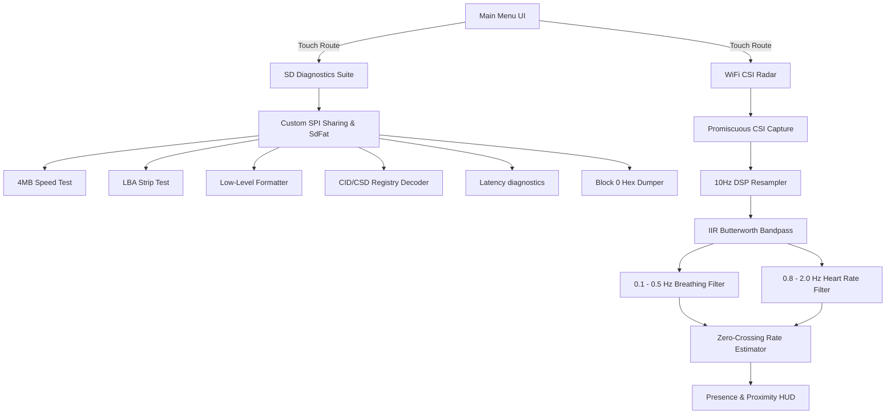

# M5Stack Core2 System Controller

A monolithic App Launcher firmware written in C++ for the **M5Stack Core2** (ESP32-D0WDQ6-V3) using PlatformIO. It features a premium capacitive touch menu routing into two low-level hardware utilities: a comprehensive **SD Card Diagnostics Suite** and a real-time **WiFi CSI Human Radar & Vital Signs Monitor**.

---

## Architecture Overview



---

## 1. WiFi CSI Human Radar: How the Physics Works

### The Physics of Channel State Information (CSI)
Wireless signals propagate from a transmitter to a receiver via multiple paths (multipath propagation), reflecting off walls, furniture, and human bodies. The receiver describes this propagation channel using **Channel State Information (CSI)**, which measures the amplitude and phase changes across the subcarriers of an Orthogonal Frequency Division Multiplexing (OFDM) channel.

When a human body is present or moving in the signal path:
1.  **Macro-movement** (walking, waving hands) alters major propagation paths, causing high-amplitude, high-frequency fluctuations in subcarrier amplitude.
2.  **Micro-movement** (chest wall expansion during breathing, blood volume pulses) subtly perturbs the multipath environment, creating small, periodic changes at lower frequencies.

### Signal Processing Pipeline

#### A. Promiscuous Sniffing
The ESP32 is initialized in station mode and promiscuous mode (`esp_wifi_set_promiscuous(true)`), locked to **Channel 6**. It registers a callback (`wifi_csi_rx_cb`) to capture raw CSI buffers from ambient 802.11 Data and Management packets. This allows it to work passively without connecting to a router or transmitting signal.

#### B. Amplitude Extraction
For each CSI packet, the ESP32 loops over 64 subcarriers. The raw CSI buffer contains signed 8-bit integers interleaved as imaginary ($I$) and real ($R$) parts:
$$A_i = \sqrt{R_i^2 + I_i^2} \quad \text{for subcarriers } i \in [0, 63]$$

#### C. Spatial Turbulence Variance
A rolling buffer tracks the last 20 frames. To measure the signal jitter caused by motion, the callback calculates the variance of the amplitude over the rolling window for each subcarrier, and then averages the variances across all 64 subcarriers to generate a single, highly sensitive scalar **Motion Score** (`latest_motion_score`).

#### D. 10 Hz Resampling
Since ambient WiFi traffic is irregular, the motion score is resampled at a fixed **10 Hz** time-base in `src/main.cpp`. This uniform series is fed into the digital filters.

#### E. Digital IIR Bandpass Filters
We implement two 2nd-order Butterworth bandpass filters designed dynamically using the Robert Bristow-Johnson (RBJ) bilinear transform:
1.  **Breathing Rate Filter (0.1 Hz – 0.5 Hz)**: Isolates chest wall expansion movements (6 to 30 breaths/min).
2.  **Heart Rate Filter (0.8 Hz – 2.0 Hz)**: Extracts high-frequency micro-displacements from cardiac pulses (48 to 120 beats/min).

The Direct Form I difference equation is applied:
$$y[n] = b_0 x[n] + b_1 x[n-1] + b_2 x[n-2] - a_1 y[n-1] - a_2 y[n-2]$$

#### F. Envelope & BPM Estimation
-   **Asymmetric Envelope Tracking**: Estimates signal strength using a fast-attack/slow-decay filter:
    $$\text{Envelope} = \text{Envelope} \cdot (1 - \alpha) + |y[n]| \cdot \alpha$$
-   **Zero-Crossing Rate Estimation**: BPM is calculated by measuring the time between successive positive-going zero crossings. If the envelope falls below the noise floor (`0.015` for breathing, `0.005` for heart rate), the BPM readouts are squelched (`-- BPM`) to prevent reporting values on background noise.

#### G. Room State Classification
-   **Presence**:
    -   `Vacant`: Motion score is very low ($< 0.15$) and breathing envelope is below noise floor ($< 0.015$).
    -   `Resting`: Motion score is low ($< 1.2$) but the breathing envelope is active ($> 0.015$), indicating a stationary person breathing or sleeping.
    -   `Active`: Motion score is high ($> 1.2$), indicating macro movement in the room.
-   **Proximity**:
    -   `Near`: High signal perturbation (motion score $> 3.0$ or breathing envelope $> 0.08$).
    -   `Mid`: Medium signal perturbation (motion score $> 1.5$ or breathing envelope $> 0.03$).
    -   `Far`: Low signal perturbation (motion score $> 0.15$ or breathing envelope $> 0.01$).

---

## 2. SD Card Diagnostics Suite

Provides a diagnostics interface to detect fake SD cards and check filesystem health:
1.  **Speed Test**: Writes/reads a **4 MB** temporary file using 32 KB aligned buffers, reporting throughput in MB/s.
2.  **LBA Strip Test (Wrap-Around Detector)**: Directly commands the memory controller bypassing the FAT filesystem. Writes signatures at 0 GB, 1 GB, 2 GB, etc., and reads them back to verify the card isn't a fake/spoofed capacity card.
3.  **Low-Level Formatter**: Automatically formats FAT32 or exFAT partitions, mapping progress dynamically to a graphical LCD progress bar.
4.  **Decode CID/CSD**: Decodes card registers to show OEM info, serial numbers, manufacturing date, and hardware revisions.
5.  **Latency Test**: Writes 2000 small (512-byte) blocks sequentially to measure maximum, minimum, and average block write latency in microseconds.
6.  **Raw Hex Dumper**: Hex-dumps Sector 0 (MBR) directly to the screen and serial console.

---

## Hardware Pinout (M5Stack Core2)

The LCD screen and SD Card share the primary SPI bus. Conflict is prevented using a custom SPI transaction wrapper (`SHARED_SPI` configuration in `src/hw_spi.h`):

| Signal | ESP32 Pin | Function |
| :--- | :--- | :--- |
| **SCK** | GPIO 18 | Shared SPI Clock |
| **MISO** | GPIO 38 | Shared SPI Master In Slave Out |
| **MOSI** | GPIO 23 | Shared SPI Master Out Slave In |
| **SD_CS** | GPIO 4 | SD Card Chip Select |
| **LCD_CS** | GPIO 5 | LCD Chip Select |

---

## Installation & Flashing

### Requirements
*   VS Code with the [PlatformIO IDE extension](https://platformio.org/).

### Build and Upload
1.  Connect your M5Stack Core2 via USB.
2.  Open VS Code in the project root.
3.  Build the project:
    ```bash
    pio run
    ```
4.  Upload the firmware (releases the serial monitor first to avoid port conflict):
    ```bash
    pio run --target upload
    ```
5.  Launch the serial monitor:
    ```bash
    pio device monitor
    ```
